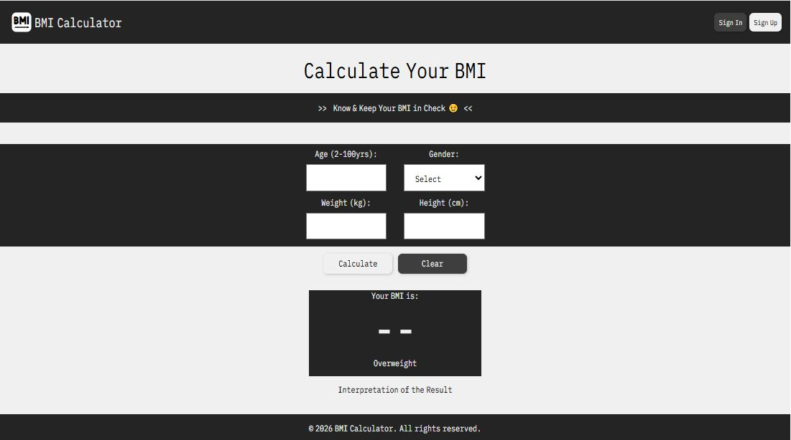

# BMI Calculator Web App

A responsive and interactive Body Mass Index (BMI) Calculator built using **HTML, CSS, and JavaScript**. This application allows users to compute their BMI, receive health classification, and view a simple interpretation of their results.

---

## Live Demo

👉 https://your-live-link-here.com
_(Replace with your Netlify/Vercel link)_

---

## Features

- User input for **weight (kg)** and **height (cm)**
- Real-time **BMI calculation**
- Automatic **BMI classification**:

- Underweight
- Normal weight
- Overweight
- Obese
- Dynamic **color-coded results**

- Green → Healthy (Normal)
- Red → Risk (Underweight, Overweight, Obese)
- Clear button to reset inputs and results
- Fully responsive and clean UI design

---

## How It Works

The BMI is calculated using the standard formula:

[
BMI = \frac{weight (kg)}{height (m)^2}
]

The application:

1. Takes user input (weight and height)
2. Converts height from cm to meters
3. Computes BMI
4. Classifies the result into standard health categories
5. Displays both the numeric result and interpretation

---

## Technologies Used

- **HTML5** – Structure
- **CSS3** – Styling & Layout
- **JavaScript (Vanilla JS)** – Logic & Interactivity

---

## Project Structure

```
bmi-calculator/
│── index.html
│── style.css
│── script.js
│── assets/
```

---

## Future Improvements

- Add BMI chart visualization 📊
- Store user history (local storage or database)
- Add unit toggle (kg/lbs, cm/ft)
- Improve accessibility and form validation
- Integrate basic health recommendations system

---

## Screenshot



---

## 👨 Author

**Jesse Charles Cobbinah**

- GitHub: https://github.com/jessecharles123

---

## 📄 License

This project is open-source and available under the **MIT License**.
